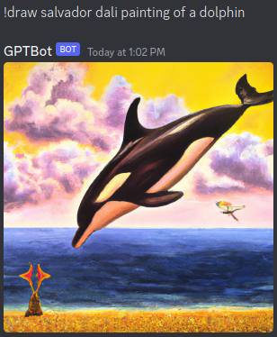

# 🤖 ChatGPT Discord Bot 🎉



📝 Interact with ChatGPT to receive text responses to questions
🎨 Generate images using the OpenAI API based on text prompts

# 🚀 Installation
```bash
pip install -r requirements.txt
```

Set the following environment variables:
```
OPENAI_API_KEY: Your OpenAI API key 🗝️
DISCORD_BOT_TOKEN: Your Discord bot token 🤖
```

Get the party started 🥳:
```bash
python3 bot.py
```

# 🕹️ Usage
Once the bot is up and running, users can interact with it using the following commands in the Discord chat:

```
!ask <question>: 🤔 Send a question to ChatGPT and receive a text response 📩
!draw <prompt>: 🎨 Request an image based on the text prompt 🖼️
```

